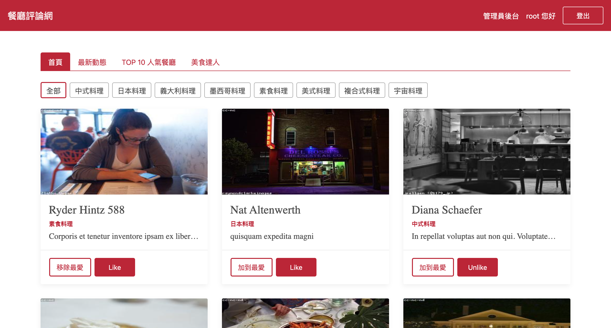

# Restaurant Forum Vue.js

透過 Vue.js 實作的餐廳評論網

## Preview



## Features

```
帳號：
user1@example.com（一般用戶）
root@example.com（管理者）

密碼：一律為12345678
```

使用者可以

- 進行帳號註冊、登入
- 根據類別篩選餐廳
- 瀏覽單一餐廳資訊及其評論
- 對餐廳按喜歡、加入最愛、留下評論
- 查看、追蹤其他用戶
- 修改個人資料

管理者後台

- 新增、瀏覽、修改、刪除餐廳資訊
- 新增、編輯、刪除餐廳類別名稱
- 修改使用者身分為一般用戶或管理員

## Prerequisites

- [Vue](https://vuejs.org/)
- [Vuex](https://vuex.vuejs.org/guide/#the-simplest-store)
- [Vue-Router](https://router.vuejs.org/)
- [Bootstrap](https://getbootstrap.com/)

## Project setup

```
npm install
```

### Compiles and hot-reloads for development

```
npm run serve
```

### Compiles and minifies for production

```
npm run build
```

### Lints and fixes files

```
npm run lint
```

### Customize configuration

See [Configuration Reference](https://cli.vuejs.org/config/).
